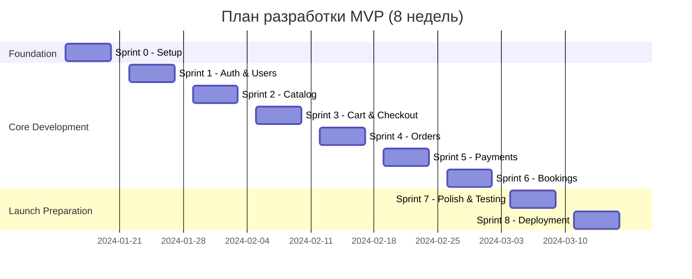

# План разработки SnailMarketplace MVP
## Roadmap и структура итераций

**Версия:** 1.0  
**Дата начала:** 2024-01-15  
**Дата MVP:** 2024-03-11 (8 недель)  
**Команда:** 5-7 человек  

---

## 📅 Общий Timeline



## 🎯 Цели MVP

### Функциональные требования
- ✅ Регистрация и аутентификация пользователей
- ✅ Каталог товаров/услуг/курсов с поиском
- ✅ Корзина и процесс оформления заказа
- ✅ Обработка платежей (один провайдер)
- ✅ Базовая панель продавца
- ✅ Уведомления (email)
- ✅ Мультиязычность (EN/RU/AR)

### Нефункциональные требования
- 📊 Производительность: p95 < 500ms
- 🔒 Безопасность: JWT auth, HTTPS, rate limiting
- 📈 Масштабируемость: до 1000 concurrent users
- 🌍 Локализация: 3 языка, 3 валюты
- 📱 Responsive: Web + Mobile web

## 👥 Команда

### Минимальный состав (5 человек)
```yaml
Tech Lead (1):
  - Архитектура
  - Code review
  - Критические модули
  - DevOps

Backend Developer (2):
  - API разработка
  - Бизнес-логика
  - Интеграции
  
Frontend Developer (1):
  - React приложение
  - UI компоненты
  - Responsive design
  
QA/Support (1):
  - Тестирование
  - Документация
  - Первичная поддержка
```

### Расширенный состав (+2)
```yaml
UI/UX Designer (1):
  - Дизайн интерфейсов
  - User flow
  - Прототипы
  
Product Manager (1):
  - Requirements
  - Приоритизация
  - Stakeholder management
```

## 📋 Структура спринтов

### Sprint Planning
- **Длительность:** 1 неделя (5 рабочих дней)
- **Церемонии:** 
  - Planning: Понедельник утро (2ч)
  - Daily: Каждый день (15 мин)
  - Review: Пятница день (1ч)
  - Retro: Пятница вечер (1ч)

### Definition of Done
- [ ] Код написан и соответствует стандартам
- [ ] Unit тесты покрывают > 80%
- [ ] Code review пройден
- [ ] Документация обновлена
- [ ] Merge в develop без конфликтов
- [ ] Функция работает в staging

### Velocity Planning
```yaml
Story Points per Sprint:
  Sprint 0: 13 (setup)
  Sprint 1: 21 (momentum building)
  Sprint 2: 34 (full speed)
  Sprint 3-6: 34-40 (sustained)
  Sprint 7: 21 (stabilization)
  Sprint 8: 13 (deployment)
  
Total: ~250 story points
```

## 🏗️ Технический стек

### Backend
```yaml
Core:
  - Node.js 20 LTS
  - TypeScript 5.x
  - NestJS 10.x
  
Database:
  - PostgreSQL 15
  - Redis 7
  
Tools:
  - TypeORM
  - Jest (testing)
  - Swagger (API docs)
```

### Frontend
```yaml
Core:
  - React 18
  - TypeScript
  - Vite

UI:
  - Bootstrap 5 (react-bootstrap)
  - React Hook Form
  - React Icons

State:
  - Zustand
  - React Query

Rationale:
  - Bootstrap chosen over Tailwind for:
    * Ready-made components (cards, modals, forms)
    * Faster MVP development
    * Built-in RTL support (important for Arabic)
    * Consistent design system out-of-the-box
    * Less boilerplate in JSX
```

### Infrastructure
```yaml
Development:
  - Docker Compose
  - LocalStack (AWS services)
  
Production:
  - Docker
  - Kubernetes/Docker Swarm
  - Nginx
  - Let's Encrypt
```

## 📊 Метрики успеха

### Технические KPI
- Build time < 5 минут
- Deploy time < 10 минут
- Test coverage > 80%
- Performance budget соблюден
- Zero critical vulnerabilities

### Бизнес KPI (первый месяц)
- 100+ зарегистрированных пользователей
- 10+ активных продавцов
- 50+ товаров в каталоге
- 10+ успешных транзакций
- NPS > 50

## 🚀 Риски и митигация

### Высокие риски
```yaml
Payment Integration Delays:
  Вероятность: Средняя
  Влияние: Критическое
  Митигация: 
    - Начать интеграцию в Sprint 3
    - Иметь fallback на manual processing
    - Подготовить тестовый аккаунт заранее

Scope Creep:
  Вероятность: Высокая
  Влияние: Высокое
  Митигация:
    - Строгий scope freeze после Sprint 0
    - Все новые features в backlog для v2
    - Weekly stakeholder updates

Performance Issues:
  Вероятность: Средняя
  Влияние: Высокое
  Митигация:
    - Performance testing с Sprint 3
    - Caching strategy с начала
    - Database indexes planning
```

## 📁 Структура файлов плана

```
development-plan/
├── OVERVIEW.md                      (этот файл)
├── sprint-0-setup.md                (инфраструктура)
├── sprint-1-auth-users.md          (аутентификация)
├── sprint-2-catalog.md             (каталог товаров)
├── sprint-3-cart-checkout.md       (корзина и чекаут)
├── sprint-4-orders.md               (заказы)
├── sprint-5-payments.md             (платежи)
├── sprint-6-bookings.md             (бронирования)
├── sprint-7-testing-polish.md      (тестирование)
├── sprint-8-deployment.md           (развертывание)
└── post-mvp-backlog.md             (что дальше)
```

## 🔄 Процесс разработки

### Git Flow
```bash
main                 # Production
├── develop         # Development
    ├── feature/*   # Feature branches
    ├── bugfix/*    # Bug fixes
    └── hotfix/*    # Emergency fixes
```

### Code Review Process
1. Create feature branch from develop
2. Implement feature with tests
3. Create Pull Request
4. Automated checks (lint, test, build)
5. Peer review (1-2 reviewers)
6. Merge to develop
7. Deploy to staging

### Deployment Strategy
```yaml
Environments:
  Local: Docker Compose
  Dev: Auto-deploy from develop
  Staging: Manual deploy, auto tests
  Production: Manual deploy with approval

Rollback:
  - Previous Docker image always kept
  - Database migrations reversible
  - Feature flags for risky features
```

## 📈 Прогресс трекинг

### Weekly Metrics
- Story points completed vs planned
- Bug count (new vs resolved)
- Test coverage %
- Build success rate
- Sprint velocity trend

### Daily Tracking
- Burndown chart
- Blockers count
- PR merge rate
- Staging deployments

## ✅ Pre-Sprint Checklist

### Technical Setup
- [ ] Git repository created
- [ ] CI/CD pipeline configured
- [ ] Development environment documented
- [ ] Coding standards defined
- [ ] Database schema drafted

### Team Setup
- [ ] Roles assigned
- [ ] Communication channels created
- [ ] Access to tools provided
- [ ] Working agreements established

### Business Setup
- [ ] Requirements finalized
- [ ] Designs approved (if available)
- [ ] Payment provider account created
- [ ] Domain registered
- [ ] Legal documents prepared

## 🎯 Success Criteria для MVP

### Must Have (Week 8)
- User registration and login
- Product catalog with search
- Shopping cart
- Order creation
- Payment processing (one method)
- Email notifications
- Basic merchant panel

### Nice to Have (если успеваем)
- SMS notifications
- Advanced search filters
- Multiple payment methods
- Analytics dashboard
- Mobile app

### Not in Scope (v2.0)
- Recommendations
- Loyalty program
- Advanced analytics
- Multiple warehouses
- B2B features

---

## Следующие шаги

1. **Review этого плана** с командой
2. **Sprint 0 kickoff** - настройка окружения
3. **Создание backlog** в Jira/GitHub Projects
4. **Onboarding команды** на проект

Детальные планы каждого спринта будут в отдельных файлах.

**Let's build! 🚀**