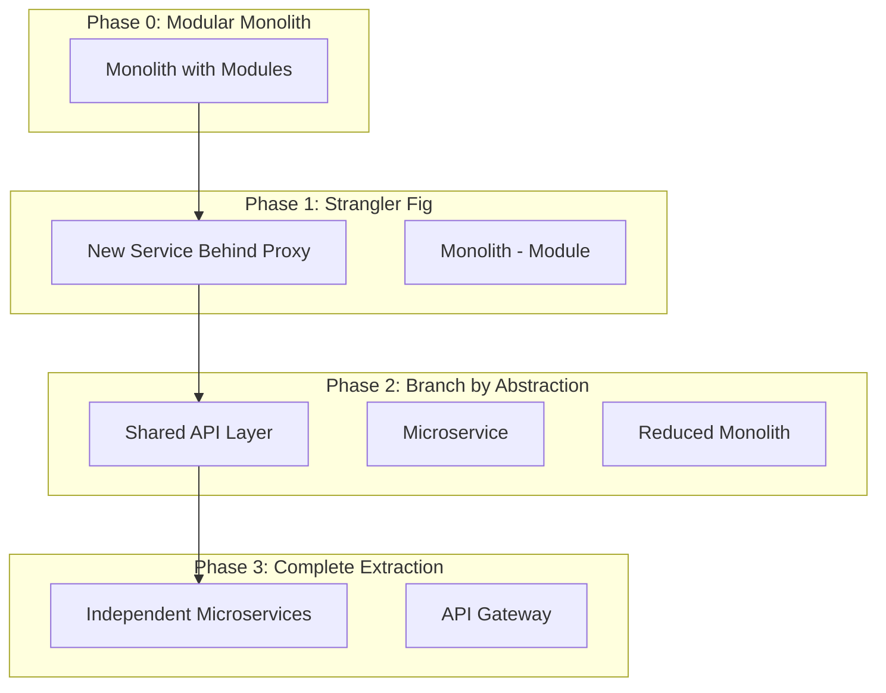

# Руководство по масштабированию: От модульного монолита к микросервисам

**Версия:** 1.0  
**Дата:** 2024-11-08  
**Проект:** SnailMarketplace  

---

## Содержание

1. [Когда масштабировать](#1-когда-масштабировать)
2. [Стратегия извлечения сервисов](#2-стратегия-извлечения-сервисов)
3. [Пошаговый процесс миграции](#3-пошаговый-процесс-миграции)
4. [Практические примеры](#4-практические-примеры)
5. [Паттерны и антипаттерны](#5-паттерны-и-антипаттерны)
6. [Инструменты и технологии](#6-инструменты-и-технологии)
7. [Метрики и мониторинг](#7-метрики-и-мониторинг)
8. [Rollback стратегии](#8-rollback-стратегии)

---

## 1. Когда масштабировать

### 1.1 Метрики для принятия решения

```yaml
Сигналы для начала разделения:

Performance:
  - Response time p95 > 1s устойчиво
  - Database connections > 80% pool
  - Memory usage > 85% после оптимизации
  - CPU usage > 70% sustained

Scale:
  - DAU > 10,000
  - Concurrent users > 500
  - Transactions/day > 5,000
  - Database size > 100GB

Team:
  - Разработчиков > 15
  - Merge conflicts > 5/week
  - Deploy queue > 3 teams waiting
  - Время на code review > 2 дня

Business:
  - Требуется разный SLA для модулей
  - Независимые релизные циклы
  - Разные compliance требования
  - Geographical distribution нужна
```

### 1.2 Матрица приоритетов для извлечения

```typescript
interface ExtractionPriority {
  service: string;
  score: number; // 0-100
  factors: {
    loadContribution: number;    // % от общей нагрузки
    changeFrequency: number;     // деплоев в месяц
    teamAutonomy: number;        // желание team ownership
    scalingNeeds: number;        // потребность в независимом scaling
    dataIsolation: number;       // нужна ли отдельная БД
  };
}

const priorities: ExtractionPriority[] = [
  {
    service: "Payments",
    score: 95,
    factors: {
      loadContribution: 30,
      changeFrequency: 20,
      teamAutonomy: 25,
      scalingNeeds: 30,
      dataIsolation: 30  // PCI compliance
    }
  },
  {
    service: "Search",
    score: 85,
    factors: {
      loadContribution: 40,  // Высокая read нагрузка
      changeFrequency: 10,
      teamAutonomy: 15,
      scalingNeeds: 35,
      dataIsolation: 20
    }
  },
  {
    service: "Notifications",
    score: 75,
    factors: {
      loadContribution: 15,
      changeFrequency: 25,  // Частые изменения шаблонов
      teamAutonomy: 20,
      scalingNeeds: 20,
      dataIsolation: 15
    }
  }
];
```

---

## 2. Стратегия извлечения сервисов

### 2.1 Фазы трансформации



### 2.2 Подготовка модуля к извлечению

```typescript
// BEFORE: Тесно связанный модуль
class OrderService {
  constructor(
    private userService: UserService,
    private inventoryService: InventoryService,
    private paymentService: PaymentService,
    private db: Database
  ) {}
  
  async createOrder(data: OrderData): Promise<Order> {
    const user = await this.userService.getUser(data.userId);
    const inventory = await this.inventoryService.reserve(data.items);
    const payment = await this.paymentService.authorize(data.payment);
    
    return this.db.transaction(async (trx) => {
      // Прямые вызовы и shared транзакции
    });
  }
}

// AFTER: Подготовленный к извлечению
class OrderService {
  constructor(
    private userClient: IUserClient,        // Интерфейс
    private inventoryClient: IInventoryClient, // Интерфейс
    private paymentClient: IPaymentClient,    // Интерфейс
    private db: Database,
    private eventBus: IEventBus              // События вместо прямых вызовов
  ) {}
  
  async createOrder(data: OrderData): Promise<Order> {
    // Использование интерфейсов, которые могут быть
    // local (в монолите) или remote (HTTP/gRPC)
    const user = await this.userClient.getUser(data.userId);
    
    // Saga pattern вместо distributed transaction
    const saga = new CreateOrderSaga(data);
    return saga.execute();
  }
}

// Адаптеры для разных режимов
class LocalUserClient implements IUserClient {
  constructor(private userService: UserService) {}
  async getUser(id: string): Promise<User> {
    return this.userService.getUser(id);
  }
}

class RemoteUserClient implements IUserClient {
  constructor(private httpClient: HttpClient) {}
  async getUser(id: string): Promise<User> {
    return this.httpClient.get(`/users/${id}`);
  }
}
```

---

## 3. Пошаговый процесс миграции

### 3.1 Извлечение Payment Service (Пример)

#### Шаг 1: Изоляция данных

```sql
-- Before: Shared tables
CREATE TABLE orders (
    id UUID PRIMARY KEY,
    user_id UUID,
    payment_status VARCHAR(50),
    payment_method VARCHAR(50),
    payment_amount INTEGER
);

-- After: Separate payment data
-- В монолите
CREATE TABLE orders (
    id UUID PRIMARY KEY,
    user_id UUID,
    payment_id UUID  -- Foreign key становится reference
);

-- В Payment Service
CREATE TABLE payments (
    id UUID PRIMARY KEY,
    order_id UUID,    -- Reference to order
    status VARCHAR(50),
    method VARCHAR(50),
    amount INTEGER,
    idempotency_key VARCHAR(255) UNIQUE
);
```

#### Шаг 2: API Gateway и routing

```typescript
// API Gateway configuration
class GatewayRouter {
  private routes = [
    {
      path: '/api/v1/payments/*',
      target: process.env.PAYMENT_SERVICE_URL || 'http://monolith:3000',
      rewrite: true
    },
    {
      path: '/api/v1/*',
      target: 'http://monolith:3000'
    }
  ];
  
  async route(request: Request): Promise<Response> {
    const route = this.matchRoute(request.path);
    
    // Feature flag для постепенного переключения
    if (route.path.includes('payments')) {
      const useNewService = await this.featureFlag.isEnabled(
        'use-payment-microservice',
        request.userId
      );
      
      if (useNewService) {
        return this.proxy(request, process.env.PAYMENT_SERVICE_URL);
      }
    }
    
    return this.proxy(request, route.target);
  }
}
```

#### Шаг 3: Dual writes для миграции данных

```typescript
class PaymentMigrationService {
  async processPayment(data: PaymentData): Promise<Payment> {
    // 1. Write to monolith (source of truth during migration)
    const monolithPayment = await this.monolithDb.create('payments', data);
    
    // 2. Async write to new service
    this.eventBus.publish('payment.created', {
      ...monolithPayment,
      _migration: true
    });
    
    // 3. Verify consistency
    this.scheduleConsistencyCheck(monolithPayment.id);
    
    return monolithPayment;
  }
  
  async scheduleConsistencyCheck(paymentId: string) {
    setTimeout(async () => {
      const monolithData = await this.monolithDb.get('payments', paymentId);
      const serviceData = await this.paymentService.get(paymentId);
      
      if (!this.isConsistent(monolithData, serviceData)) {
        await this.reconcile(monolithData, serviceData);
      }
    }, 5000);
  }
}
```

#### Шаг 4: Переключение трафика

```typescript
// Progressive rollout
class TrafficSwitcher {
  async shouldUseNewService(userId: string, feature: string): boolean {
    const rolloutPercentage = await this.getRolloutPercentage(feature);
    
    // Consistent hashing для пользователя
    const hash = this.hashUserId(userId);
    const threshold = rolloutPercentage * 0xFFFFFFFF / 100;
    
    return hash < threshold;
  }
  
  async updateRollout(feature: string, percentage: number) {
    // Постепенное увеличение: 0% -> 1% -> 5% -> 25% -> 50% -> 100%
    await this.config.set(`rollout.${feature}`, percentage);
    
    // Мониторинг метрик после изменения
    await this.monitor.trackRolloutChange(feature, percentage);
  }
}
```

### 3.2 Database Migration Strategy

```typescript
// Стратегия миграции данных
class DataMigrationOrchestrator {
  async migrateToService(serviceName: string) {
    const stages = [
      this.backfillHistoricalData,
      this.enableDualWrites,
      this.validateConsistency,
      this.switchReadTraffic,
      this.disableLegacyWrites,
      this.cleanupOldData
    ];
    
    for (const stage of stages) {
      console.log(`Starting: ${stage.name}`);
      
      try {
        await stage.call(this, serviceName);
        await this.checkpoint(serviceName, stage.name);
      } catch (error) {
        await this.rollback(serviceName, stage.name);
        throw error;
      }
    }
  }
  
  async backfillHistoricalData(service: string) {
    const batchSize = 1000;
    let offset = 0;
    
    while (true) {
      const records = await this.monolithDb.query(
        `SELECT * FROM ${service}_data LIMIT ${batchSize} OFFSET ${offset}`
      );
      
      if (records.length === 0) break;
      
      // ETL pipeline
      const transformed = await this.transform(records, service);
      await this.loadToNewService(transformed, service);
      
      offset += batchSize;
      
      // Rate limiting
      await this.sleep(100);
    }
  }
}
```

---

## 4. Практические примеры

### 4.1 Извлечение Search Service

```typescript
// Before: Search в монолите
class MonolithSearchService {
  async search(query: string, filters: Filters): Promise<Product[]> {
    const sql = `
      SELECT p.*, pt.name, pt.description
      FROM products p
      LEFT JOIN product_translations pt ON p.id = pt.product_id
      WHERE pt.name ILIKE $1
      AND p.price BETWEEN $2 AND $3
      ORDER BY p.created_at DESC
      LIMIT 20
    `;
    
    return this.db.query(sql, [`%${query}%`, filters.minPrice, filters.maxPrice]);
  }
}

// Step 1: Создаем поисковый индекс
class SearchIndexBuilder {
  async buildIndex() {
    // CDC (Change Data Capture) from PostgreSQL
    const changes = await this.cdc.captureChanges('products');
    
    for (const change of changes) {
      const document = this.transformToSearchDocument(change);
      
      // Индексируем в Elasticsearch
      await this.elasticsearch.index({
        index: 'products',
        id: document.id,
        body: document
      });
    }
  }
  
  transformToSearchDocument(product: any) {
    return {
      id: product.id,
      name: product.translations,
      description: product.description,
      price: product.price,
      categories: product.categories,
      attributes: product.attributes,
      merchant: product.merchant_name,
      boost: this.calculateBoost(product)
    };
  }
}

// Step 2: Dual read with fallback
class HybridSearchService {
  async search(query: string, filters: Filters): Promise<Product[]> {
    try {
      // Пробуем новый сервис
      const results = await this.elasticsearchService.search(query, filters);
      
      // Async comparison для валидации
      this.compareResults(query, filters);
      
      return results;
    } catch (error) {
      // Fallback на старый поиск
      this.metrics.increment('search.fallback');
      return this.monolithSearch.search(query, filters);
    }
  }
  
  async compareResults(query: string, filters: Filters) {
    // Асинхронное сравнение для метрик
    setTimeout(async () => {
      const oldResults = await this.monolithSearch.search(query, filters);
      const newResults = await this.elasticsearchService.search(query, filters);
      
      const similarity = this.calculateSimilarity(oldResults, newResults);
      this.metrics.gauge('search.similarity', similarity);
      
      if (similarity < 0.8) {
        this.logger.warn('Search results divergence detected', {
          query,
          filters,
          similarity
        });
      }
    }, 0);
  }
}

// Step 3: Полностью независимый сервис
@Controller('search')
class SearchMicroservice {
  constructor(
    private elastic: ElasticsearchService,
    private kafka: KafkaService
  ) {
    // Subscribe to product events
    this.kafka.subscribe('products.*', this.handleProductEvent.bind(this));
  }
  
  @Get('/')
  async search(@Query() params: SearchParams) {
    const query = this.buildElasticQuery(params);
    
    const results = await this.elastic.search({
      index: 'products',
      body: query
    });
    
    return this.transformResults(results);
  }
  
  async handleProductEvent(event: ProductEvent) {
    switch (event.type) {
      case 'product.created':
      case 'product.updated':
        await this.indexProduct(event.data);
        break;
      case 'product.deleted':
        await this.removeFromIndex(event.data.id);
        break;
    }
  }
}
```

### 4.2 Извлечение Notification Service

```typescript
// Эволюция от синхронного к асинхронному

// Stage 1: Синхронные вызовы в монолите
class OrderService {
  async completeOrder(orderId: string) {
    const order = await this.db.updateOrder(orderId, 'completed');
    
    // Блокирующий вызов
    await this.emailService.sendOrderConfirmation(order);
    await this.smsService.sendSMS(order.phone, 'Order completed');
    
    return order;
  }
}

// Stage 2: Асинхронный через Outbox
class OrderServiceV2 {
  async completeOrder(orderId: string) {
    await this.db.transaction(async (trx) => {
      const order = await trx.updateOrder(orderId, 'completed');
      
      // Сохраняем события в outbox
      await trx.insertOutboxEvent({
        aggregate_id: orderId,
        event_type: 'order.completed',
        payload: order,
        status: 'pending'
      });
    });
    
    // Не ждем отправки
    return order;
  }
}

// Stage 3: Отдельный Notification Service
@Injectable()
class NotificationMicroservice {
  constructor(
    private readonly templates: TemplateService,
    private readonly providers: NotificationProviders,
    private readonly queue: BullQueue
  ) {}
  
  @EventPattern('order.completed')
  async handleOrderCompleted(event: OrderCompletedEvent) {
    // Определяем какие уведомления отправить
    const notifications = await this.determineNotifications(event);
    
    for (const notification of notifications) {
      await this.queue.add('send-notification', {
        type: notification.type,
        recipient: notification.recipient,
        template: notification.template,
        data: notification.data,
        retry: {
          attempts: 3,
          backoff: {
            type: 'exponential',
            delay: 2000
          }
        }
      });
    }
  }
  
  @Process('send-notification')
  async sendNotification(job: Job<NotificationJob>) {
    const { type, recipient, template, data } = job.data;
    
    try {
      const rendered = await this.templates.render(template, data);
      
      switch (type) {
        case 'email':
          await this.providers.email.send(recipient, rendered);
          break;
        case 'sms':
          await this.providers.sms.send(recipient, rendered);
          break;
        case 'push':
          await this.providers.push.send(recipient, rendered);
          break;
      }
      
      await this.recordDelivery(job.data);
    } catch (error) {
      // Bull автоматически сделает retry
      throw error;
    }
  }
}
```

---

## 5. Паттерны и антипаттерны

### 5.1 Правильные паттерны

#### ✅ Strangler Fig Pattern
```typescript
// Постепенная замена функциональности
class StranglerFigProxy {
  async handleRequest(req: Request): Promise<Response> {
    const feature = this.extractFeature(req);
    
    if (this.newFeatures.includes(feature)) {
      return this.newService.handle(req);
    }
    
    return this.legacyService.handle(req);
  }
}
```

#### ✅ Anti-Corruption Layer
```typescript
// Защита от изменений в legacy системе
class AntiCorruptionLayer {
  async getUser(legacyUserId: number): Promise<User> {
    const legacyUser = await this.legacySystem.getUser(legacyUserId);
    
    // Transform legacy format to domain model
    return {
      id: uuid(),
      externalId: legacyUserId.toString(),
      email: legacyUser.email_address,
      name: `${legacyUser.first_name} ${legacyUser.last_name}`,
      createdAt: new Date(legacyUser.created_timestamp * 1000)
    };
  }
}
```

#### ✅ Event-Driven Decoupling
```typescript
// События вместо прямых вызовов
class OrderService {
  async createOrder(data: OrderData): Promise<Order> {
    const order = await this.db.createOrder(data);
    
    // Публикуем событие вместо вызова сервисов
    await this.eventBus.publish('order.created', {
      orderId: order.id,
      userId: order.userId,
      items: order.items,
      total: order.total
    });
    
    return order;
  }
}

// Сервисы реагируют на события
class InventoryService {
  @EventHandler('order.created')
  async handleOrderCreated(event: OrderCreatedEvent) {
    await this.reserveItems(event.items);
  }
}
```

### 5.2 Антипаттерны (чего избегать)

#### ❌ Distributed Monolith
```typescript
// ПЛОХО: Синхронные вызовы между сервисами
class BadOrderService {
  async createOrder(data: OrderData) {
    // Каскад синхронных вызовов
    const user = await this.userService.getUser(data.userId); // HTTP
    const inventory = await this.inventoryService.check(data.items); // HTTP
    const price = await this.pricingService.calculate(data); // HTTP
    const payment = await this.paymentService.authorize(data); // HTTP
    
    // Если любой сервис недоступен - все падает
    return this.db.createOrder({ user, inventory, price, payment });
  }
}

// ХОРОШО: Асинхронная оркестрация
class GoodOrderService {
  async createOrder(data: OrderData) {
    // Создаем заказ со статусом pending
    const order = await this.db.createOrder({
      ...data,
      status: 'pending'
    });
    
    // Запускаем saga
    await this.sagaOrchestrator.start('CreateOrderSaga', {
      orderId: order.id,
      data
    });
    
    return order;
  }
}
```

#### ❌ Shared Database
```typescript
// ПЛОХО: Сервисы используют общую БД
class PaymentService {
  async processPayment(orderId: string) {
    // Прямой доступ к таблицам другого сервиса
    const order = await this.db.query('SELECT * FROM orders WHERE id = $1', [orderId]);
    const user = await this.db.query('SELECT * FROM users WHERE id = $1', [order.user_id]);
    
    // Изменения схемы сломают другие сервисы
  }
}

// ХОРОШО: API или события для получения данных
class PaymentService {
  async processPayment(orderId: string) {
    // Получаем данные через API
    const order = await this.orderApi.getOrder(orderId);
    
    // Или из локальной проекции (CQRS)
    const user = await this.userProjection.get(order.userId);
  }
}
```

---

## 6. Инструменты и технологии

### 6.1 Service Mesh (Istio/Linkerd)

```yaml
# Istio VirtualService для canary deployment
apiVersion: networking.istio.io/v1beta1
kind: VirtualService
metadata:
  name: payment-service
spec:
  http:
  - match:
    - headers:
        x-user-segment:
          exact: beta
    route:
    - destination:
        host: payment-v2
        weight: 100
  - route:
    - destination:
        host: payment-v1
        weight: 90
    - destination:
        host: payment-v2
        weight: 10  # 10% canary
```

### 6.2 API Gateway (Kong/Envoy)

```typescript
// Kong plugin для migration routing
class MigrationRouterPlugin {
  async access(kong: Kong) {
    const serviceName = kong.request.getHeader('X-Service-Target');
    const userId = kong.request.getHeader('X-User-Id');
    
    // Check if user should use new service
    const useNewService = await this.checkMigrationStatus(serviceName, userId);
    
    if (useNewService) {
      // Route to new microservice
      await kong.service.setTarget(
        `${serviceName}-service.production.svc.cluster.local`,
        8080
      );
    } else {
      // Route to monolith
      await kong.service.setTarget(
        'monolith.production.svc.cluster.local',
        3000
      );
    }
  }
}
```

### 6.3 Distributed Tracing

```typescript
// OpenTelemetry integration
import { trace, context, SpanStatusCode } from '@opentelemetry/api';

class TracedOrderService {
  private tracer = trace.getTracer('order-service');
  
  async createOrder(data: OrderData): Promise<Order> {
    const span = this.tracer.startSpan('createOrder');
    
    try {
      // Add attributes
      span.setAttributes({
        'order.user_id': data.userId,
        'order.items_count': data.items.length,
        'order.total': data.total
      });
      
      // Propagate context to downstream services
      const ctx = trace.setSpan(context.active(), span);
      
      const order = await context.with(ctx, async () => {
        const inventory = await this.inventoryClient.reserve(data.items);
        const payment = await this.paymentClient.authorize(data.payment);
        
        return this.db.createOrder({
          ...data,
          inventoryReservation: inventory,
          paymentAuth: payment
        });
      });
      
      span.setStatus({ code: SpanStatusCode.OK });
      return order;
    } catch (error) {
      span.recordException(error);
      span.setStatus({ code: SpanStatusCode.ERROR });
      throw error;
    } finally {
      span.end();
    }
  }
}
```

---

## 7. Метрики и мониторинг

### 7.1 Ключевые метрики миграции

```typescript
interface MigrationMetrics {
  // Производительность
  latency: {
    monolith_p50: number;
    monolith_p99: number;
    microservice_p50: number;
    microservice_p99: number;
    degradation_threshold: 1.2; // 20% допустимая деградация
  };
  
  // Надежность
  availability: {
    monolith_uptime: number;
    microservice_uptime: number;
    error_rate_delta: number;
  };
  
  // Консистентность данных
  consistency: {
    divergence_rate: number;  // % расхождений
    reconciliation_lag: number; // секунды
    data_loss_events: number;
  };
  
  // Бизнес-метрики
  business: {
    conversion_rate_change: number;
    checkout_success_rate: number;
    average_order_value: number;
  };
}

// Мониторинг в реальном времени
class MigrationMonitor {
  async checkHealth(): Promise<HealthStatus> {
    const metrics = await this.collectMetrics();
    
    const checks = [
      {
        name: 'latency',
        pass: metrics.latency.microservice_p99 <= 
              metrics.latency.monolith_p99 * metrics.latency.degradation_threshold
      },
      {
        name: 'error_rate',
        pass: metrics.availability.error_rate_delta < 0.01 // 1%
      },
      {
        name: 'data_consistency',
        pass: metrics.consistency.divergence_rate < 0.001 // 0.1%
      },
      {
        name: 'business_metrics',
        pass: metrics.business.conversion_rate_change > -0.02 // -2%
      }
    ];
    
    const failing = checks.filter(c => !c.pass);
    
    if (failing.length > 0) {
      await this.alert('Migration health check failed', failing);
      
      if (failing.some(c => c.name === 'data_consistency')) {
        // Критическая проблема - автоматический rollback
        await this.initiateRollback();
      }
    }
    
    return {
      healthy: failing.length === 0,
      checks,
      metrics
    };
  }
}
```

### 7.2 Dashboards

```yaml
Grafana Dashboards:

Migration Overview:
  - Traffic split percentage (monolith vs microservices)
  - Request rate by service
  - Error rate comparison
  - Latency comparison (p50, p95, p99)
  - Database query time
  - Cache hit rate

Service Health:
  - Uptime per service
  - Request/Response times
  - Error breakdown by type
  - Resource utilization
  - Dependency health

Data Consistency:
  - Sync lag (monolith → microservice)
  - Reconciliation errors
  - Data validation failures
  - Eventual consistency metrics

Business Impact:
  - Conversion funnel by service version
  - Payment success rate
  - Cart abandonment rate
  - Customer satisfaction scores
```

---

## 8. Rollback стратегии

### 8.1 Автоматический rollback

```typescript
class AutoRollbackController {
  private rollbackTriggers = {
    errorRate: 0.05,        // 5% error rate
    latencyIncrease: 2.0,   // 2x latency
    conversionDrop: 0.10,   // 10% drop in conversion
    dataInconsistency: 0.01 // 1% data mismatch
  };
  
  async monitor() {
    const metrics = await this.metricsCollector.collect();
    
    for (const [metric, threshold] of Object.entries(this.rollbackTriggers)) {
      if (metrics[metric] > threshold) {
        await this.initiateRollback(metric, metrics[metric], threshold);
        break;
      }
    }
  }
  
  async initiateRollback(trigger: string, value: number, threshold: number) {
    console.error(`Rollback triggered: ${trigger} = ${value} > ${threshold}`);
    
    // 1. Stop new traffic to microservice
    await this.featureFlags.disable('use-microservice');
    
    // 2. Drain existing connections
    await this.loadBalancer.drainConnections('microservice', {
      timeout: 30000
    });
    
    // 3. Switch all traffic to monolith
    await this.router.setRoute('/*', 'monolith');
    
    // 4. Verify monolith is handling traffic
    await this.healthChecker.verify('monolith');
    
    // 5. Alert team
    await this.alerting.critical('Automatic rollback executed', {
      trigger,
      value,
      threshold,
      timestamp: new Date()
    });
  }
}
```

### 8.2 Data rollback

```typescript
class DataRollbackService {
  async rollbackData(service: string, pointInTime: Date) {
    // 1. Stop writes to new service
    await this.disableWrites(service);
    
    // 2. Take snapshot of current state
    const snapshot = await this.createSnapshot(service);
    
    // 3. Identify data to rollback
    const changes = await this.getChangesAfter(service, pointInTime);
    
    // 4. Generate compensating transactions
    const compensations = changes.map(change => 
      this.generateCompensation(change)
    );
    
    // 5. Apply compensations
    for (const compensation of compensations) {
      await this.applyCompensation(compensation);
    }
    
    // 6. Verify data consistency
    const consistent = await this.verifyConsistency(service);
    
    if (!consistent) {
      // Restore from backup if compensation failed
      await this.restoreFromBackup(service, pointInTime);
    }
    
    // 7. Re-enable monolith as source of truth
    await this.switchSourceOfTruth(service, 'monolith');
  }
}
```

---

## Заключение

### Ключевые принципы успешного масштабирования:

1. **Измеряйте все** - метрики до, во время и после миграции
2. **Мигрируйте постепенно** - не больше одного сервиса за раз
3. **Всегда имейте rollback план** - автоматический и ручной
4. **Dual writes для безопасности** - пишите в оба места во время миграции
5. **Feature flags обязательны** - контролируйте трафик программно
6. **Мониторинг бизнес-метрик** - не только технических
7. **Документируйте все** - другие будут делать следующие миграции

### Timeline типичной миграции одного сервиса:

```yaml
Week 1-2: Подготовка
  - Изоляция модуля
  - Создание интерфейсов
  - Написание тестов

Week 3-4: Инфраструктура
  - Setup нового сервиса
  - Конфигурация routing
  - Настройка мониторинга

Week 5-6: Миграция данных
  - Backfill исторических данных
  - Включение dual writes
  - Валидация консистентности

Week 7-8: Переключение трафика
  - 1% → 5% → 25% → 50% → 100%
  - Мониторинг метрик
  - Исправление проблем

Week 9-10: Cleanup
  - Удаление старого кода
  - Отключение dual writes
  - Оптимизация

Total: ~2.5 месяца на сервис
```

### Помните:
> "Микросервисы - это не цель, а средство. Если монолит работает - не трогайте его без веской причины."